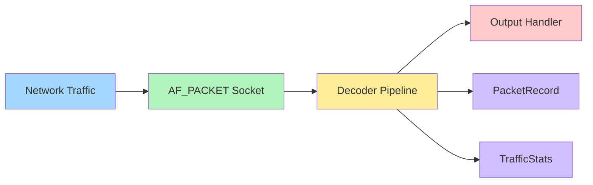

# PacketSniffer

A production-grade network packet analyzer in pure Python (stdlib only). Captures all IP traffic (TCP, UDP, ICMP), decodes headers at every OSI layer, tracks statistics, and outputs to console/NDJSON/CSV.

---

## What It Does

- **Captures all IP protocols** — TCP, UDP, ICMP via raw socket
- **Decodes headers** — Ethernet (L2), IPv4 (L3), TCP/UDP/ICMP (L4)
- **Filters by protocol** — capture only what you need
- **Tracks statistics** — per-protocol counts, top talkers, top ports
- **Multiple outputs** — ANSI console, NDJSON, CSV

---

## How It Works

```
Network → AF_PACKET Socket → Strip Ethernet → Decode IP → Decode Transport
    → Filter → Stats → Output (console/json/csv)
```

1. **Socket**: `AF_PACKET` receives all Ethernet frames on Linux
2. **Strip**: Remove 14-byte Ethernet header, keep only IPv4 (EtherType 0x0800)
3. **Decode IP**: `ctypes.Structure` parses 20-byte IPv4 header
4. **Decode Transport**: TCP (ports, flags), UDP (ports), ICMP (type/code)
5. **Output**: Console with ANSI colors, or NDJSON/CSV file

---

## System Design

> Open `system-design.excalidraw` in [excalidraw.com](https://excalidraw.com) to view/edit the diagram.

### Mermaid Diagram (import to Excalidraw)



### Components

| Component | File | Purpose |
|-----------|------|---------|
| PacketSniffer | `capture.py` | Raw socket loop, filtering, dispatch |
| PacketDecoder | `decoder.py` | Stateless L2/L3/L4 header parsers |
| PacketRecord | `models.py` | Immutable packet data model |
| TrafficStats | `stats.py` | Rolling counters (`Counter`) |
| OutputHandler | `output.py` | Console/NDJSON/CSV output |

---

## Tech Stack

| Component | Technology |
|-----------|------------|
| Language | Python 3.8+ |
| Socket | `socket` (AF_PACKET on Linux) |
| Binary Parsing | `ctypes.Structure` for IPv4, `struct` for TCP/UDP/ICMP |
| Statistics | `collections.Counter` |
| CLI | `argparse` |
| Data Model | `dataclasses` (frozen) |
| Output | Console (ANSI), `json` (NDJSON), `csv` |
| Testing | `unittest` (44 tests, no third-party) |

**Zero third-party dependencies** — runs anywhere Python 3.8+ is installed.

---

## Quick Start

```bash
# Capture all traffic
sudo python3 main.py

# Capture 100 TCP packets
sudo python3 main.py -p tcp -n 100

# Save to JSON
sudo python3 main.py -f json -o capture.json

# Run tests
python3 -m unittest discover -s tests -v
```

| Flag | Default | Description |
|------|---------|-------------|
| `-p` | `all` | Protocol filter: `all`, `tcp`, `udp`, `icmp` |
| `-n` | `0` | Packet count (0 = unbounded) |
| `-f` | `console` | Format: `console`, `json`, `csv` |
| `-v` | off | Verbose (capture first 64 bytes of payload) |

---

## Example Output

```
[PacketSniffer] interface=0.0.0.0 protocol=all format=console pid=12345
15:42:01.123 TCP  192.168.1.10:54321 -> 93.184.216.34:443   ttl=64 size=60 [SYN]
15:42:01.126 UDP  192.168.1.10:52341 -> 8.8.8.8:53          ttl=64 size=52
15:42:01.200 ICMP 192.168.1.10 -> 8.8.8.8                   ttl=64 size=84 Echo Request
```

---

## Limitations

- **Linux/macOS only** — raw sockets require root
- **IPv4 only** — no IPv6 support
- **Windows not supported** — requires `SIO_RCVALL` ioctl
